<!-- README.md is generated from README.Rmd. Please edit that file -->

# Demonstration of use of computer vision capabilities of large language models (LLMs) using R

<!-- badges: start -->

[](https://www.repostatus.org/#wip)
[](https://github.com/OxfordIHTM/computer-vision-demo/releases/tag/v0.0.0.9005)
[](https://opensource.org/licenses/gpl-3.0.html)
[](https://creativecommons.org/licenses/by/4.0/)
[](https://creativecommons.org/public-domain/cc0/)
[](https://doi.org/10.5281/zenodo.20782176)
<!-- badges: end -->

This repository is a
[`docker`](https://www.docker.com/get-started)-containerised,
[`{targets}`](https://docs.ropensci.org/targets/)-based,
[`{renv}`](https://rstudio.github.io/renv/articles/renv.html)-enabled
[`R`](https://cran.r-project.org/) workflow for demonstrating the use of
computer vision capabilities of large language models (LLMs).

## About the demonstration

This demonstration project is designed to showcase the computer vision
capabilities of large language models (LLMs) using R. The following use
cases are currently demonstrated:

- Text extraction from images of handwritten notes

The workflow is structured to facilitate reproducibility and ease of use
so that users can easily replicate the demonstration on their own
systems and build upon the existing work for their own use cases.

## Repository Structure

The project repository is structured as follows:

    computer-vision-demo
        |-- .git-crypt
        |-- .github/
        |-- R/
        |-- auth/
        |-- data-raw/
        |-- data/
        |-- outputs/
        |-- prompts/
        |-- renv
        |-- reports
        |-- .Rprofile
        |-- _targets.R
        |-- packages.R
        |-- renv.lock

- `.git-crypt` contains files used to encrypt sensitive information in
  the repository, such as API keys and credentials, using the
  `git-crypt` tool. This ensures that sensitive information is not
  exposed in the public repository.

- `.github` contains project testing and automated deployment of outputs
  workflows via continuous integration and continuous deployment (CI/CD)
  using Github Actions.

- `R/` contains functions developed/created specifically for use in this
  workflow.

- `auth/` contains files used to authenticate with external services,
  such as APIs, that are used in the workflow. These files may contain
  sensitive information, such as API keys and credentials, and should be
  kept secure.

- `data-raw/` contains raw datasets, usually either downloaded from
  source or added manually, that are used in the project.

- `data/` contains intermediate and final data outputs produced by the
  workflow.

- `outputs/` contains compiled reports and figures produced by the
  workflow.

- `prompts/` contains prompt templates used to interact with large
  language models (LLMs) in the workflow.

- `renv/` contains `renv` package specific files and directories used by
  the package for maintaining R package dependencies within the project.
  The directory `renv/library`, is a library that contains all packages
  currently used by the project. This directory, and all files and
  sub-directories within it, are all generated and managed by the `renv`
  package. Users should not change/edit these manually.

- `reports/` contains literate code for R Markdown and/or Quarto reports
  rendered in the workflow.

- `.Rprofile` file is a project R profile generated when initiating
  `renv` for the first time. This file is run automatically every time R
  is run within this project, and `renv` uses it to configure the R
  session to use the `renv` project library.

- `_targets.R` file defines the steps in the workflow’s data ingest,
  data processing, data analysis, and reporting pipeline.

- `packages.R` file lists out all R package dependencies required by the
  workflow.

- `renv.lock` file is the `renv` lockfile which records enough metadata
  about every package used in this project that it can be re-installed
  on a new machine. This file is generated by the `renv` package and
  should not be changed/edited manually.

## Reproducibility

### System dependencies

This project requires the following system dependencies:

- `poppler`

This project depends on the
[`{pdftools}`](https://docs.ropensci.org/pdftools/) package which
requires the [`poppler`](https://poppler.freedesktop.org/) PDF rendering
library to be installed first. For macOS and Windows users, installation
of `{pdftools}` via the binary packages available from CRAN will deal
with this requirement automatically. However, for Linux users, the
`poppler` library will need to be installed first in order to be able to
install `{pdftools}` from source. Installation of the `poppler` library
for Linux is described
[here](https://docs.ropensci.org/pdftools/#installation).

- `quarto`

This project uses v1.9.38 of [`quarto`](https://quarto.org/) open-source
scientific and technical publishing system. Instructions on how to
download and install `quarto` can be found
[here](https://quarto.org/docs/get-started/).

- `ollama`

This project uses [`ollama`](https://ollama.com/) to serve open large
language models locally. Instructions on how to download and install
`ollama` can be found [here](https://ollama.com/download). This project
specifically uses the following open source models available via
`ollama`:

| **Model Name**  | **RAM size** | **Context Window** |
|:----------------|-------------:|-------------------:|
| `gemma4:31b`    |       20.0GB |     256,000 tokens |
| `deepseek-ocr`  |        6.7GB |       8,000 tokens |
| `qwen3-vl:32b`  |       21.0GB |     256,000 tokens |
| `llava:13b`     |        8.0GB |       4,000 tokens |
| `llama4:16x17b` |       67.0GB |  10,000,000 tokens |

Once `ollama` is installed, pull the mentioned models above into your
local machine. Please note the required random access memory (RAM) sizes
for each of these models and ensure that the machine you are using has
enough RAM to fit these models.

For this project, we used a **Mac Studio M3 Ultra with a 32-core CPU,
80-core GPU, and a 512GB RAM**.

### R version

This project is built using `R 4.6.0`. To manage R versions, it is
recommended to use [`rig`](https://github.com/r-lib/rig) - an R
installation manager - to be able to install multiple versions of R and
switch between them as needed.

### R package dependencies

This project uses the `{renv}` framework to record R package
dependencies and versions. Packages and versions used are recorded in
`renv.lock` and code used to manage dependencies is in the `renv`
directory and other files in the root project directory.

On starting an R session in the working directory of this repository,
first run

``` r
renv::restore()
```

to install R package dependencies. This is only done once when the
project is being initiated for the first time by a user.

### Encryption

This project uses encrypted environment variables and authentication
keys used to authenticate with the different services used by the
project. These services include:

- Large language models (LLMs) provided by
  [OpenAI](https://chatgpt.com/), [Anthropic](https://claude.ai/new),
  and [Google](https://gemini.google.com/); and,

- [Sheets](https://sheets.google.com),
  [Drive](https://drive.google.com), and
  [Gmail](https://mail.google.com) services provided by
  [Google](https://www.google.com).

Encryption is managed using
[`git-crypt`](https://github.com/AGWA/git-crypt). Collaborators will
need to [install `git-crypt`](https://github.com/AGWA/git-crypt) and
then provide their GPG key to the repository administrators to be added
as an authorised user within the repository. To get a GPG key, [download
and install GPG](https://www.gnupg.org/download/) and then [generate
your GPG key pair](https://www.gnupg.org/gph/en/manual/c14.html). Then
provide your GPG key id to the authors.

Once given permission into the project and GPG key id added to the
repository, update your local version of the repository by doing a
`git pull` and then unlock the encrypted files/folders of the repository
by running the following command on the terminal from within the project
directory:

``` bash
git-crypt unlock
```

The encrypted components of the repository will now be decrypted and
accessible for running the workflow (described below).

### The workflow

The current workflow has the following steps:

``` mermaid
graph LR
  style Graph fill:#FFFFFF00,stroke:#000000;
  subgraph Graph
    direction LR
    x35a7fe2b14fea884(["claude_extractor"]):::skipped --> xbf558aaf2fd08c0e["claude_extraction"]:::completed
    x39d4d013227f0dc3(["claude_model"]):::skipped --> xbf558aaf2fd08c0e["claude_extraction"]:::completed
    xcde58b2bce8a2260["data_jpg_files"]:::skipped --> xbf558aaf2fd08c0e["claude_extraction"]:::completed
    x487a49d42720222c(["extraction_output_type"]):::skipped --> xbf558aaf2fd08c0e["claude_extraction"]:::completed
    xbf558aaf2fd08c0e["claude_extraction"]:::completed --> xf7e321d17883c5ef(["claude_extraction_results_long"]):::completed
    xf7e321d17883c5ef(["claude_extraction_results_long"]):::completed --> xf9a93278d27784db(["claude_extraction_results_long_csv"]):::completed
    xbf558aaf2fd08c0e["claude_extraction"]:::completed --> x2d9238b8268822f3(["claude_extraction_results_wide"]):::completed
    x2d9238b8268822f3(["claude_extraction_results_wide"]):::completed --> xe433f203ebf8c762(["claude_extraction_results_wide_csv"]):::completed
    x39d4d013227f0dc3(["claude_model"]):::skipped --> x35a7fe2b14fea884(["claude_extractor"]):::skipped
    x982a35c892e245ee(["extraction_context_prompt"]):::skipped --> x35a7fe2b14fea884(["claude_extractor"]):::skipped
    xf64c2f26e3ae28ce(["data_pdf_file"]):::skipped --> xcde58b2bce8a2260["data_jpg_files"]:::skipped
    xe79485d2cbaf929c(["data_pdf_pages"]):::skipped --> xcde58b2bce8a2260["data_jpg_files"]:::skipped
    xf64c2f26e3ae28ce(["data_pdf_file"]):::skipped --> x6fd840ed377697c4["data_png_files"]:::queued
    xe79485d2cbaf929c(["data_pdf_pages"]):::skipped --> x6fd840ed377697c4["data_png_files"]:::queued
    xb957a37aad5b67c5(["local_deepseek_model"]):::queued --> xb9f66fc85a4f1ea1["deepseek_extraction"]:::queued
    x487a49d42720222c(["extraction_output_type"]):::skipped --> xb9f66fc85a4f1ea1["deepseek_extraction"]:::queued
    xcde58b2bce8a2260["data_jpg_files"]:::skipped --> xb9f66fc85a4f1ea1["deepseek_extraction"]:::queued
    xf407d53739ed0632(["deepseek_extractor"]):::queued --> xb9f66fc85a4f1ea1["deepseek_extraction"]:::queued
    xb9f66fc85a4f1ea1["deepseek_extraction"]:::queued --> x9d3427148e3c7932(["deepseek_extraction_results_long"]):::queued
    x9d3427148e3c7932(["deepseek_extraction_results_long"]):::queued --> xe28ab1ac941e0e79(["deepseek_extraction_results_long_csv"]):::queued
    xb9f66fc85a4f1ea1["deepseek_extraction"]:::queued --> x7702ede3c10795a2(["deepseek_extraction_results_wide"]):::queued
    x7702ede3c10795a2(["deepseek_extraction_results_wide"]):::queued --> x3a91cc767d5c7ea7(["deepseek_extraction_results_wide_csv"]):::queued
    xd80b74a2359c73d0(["extraction_context_ollama_prompt"]):::queued --> xf407d53739ed0632(["deepseek_extractor"]):::queued
    xb957a37aad5b67c5(["local_deepseek_model"]):::queued --> xf407d53739ed0632(["deepseek_extractor"]):::queued
    xf407d53739ed0632(["deepseek_extractor"]):::queued --> xe59d676cc895fc8f["deepseek_test_extraction"]:::queued
    xb957a37aad5b67c5(["local_deepseek_model"]):::queued --> xe59d676cc895fc8f["deepseek_test_extraction"]:::queued
    x487a49d42720222c(["extraction_output_type"]):::skipped --> xe59d676cc895fc8f["deepseek_test_extraction"]:::queued
    xcde58b2bce8a2260["data_jpg_files"]:::skipped --> xe59d676cc895fc8f["deepseek_test_extraction"]:::queued
    xe59d676cc895fc8f["deepseek_test_extraction"]:::queued --> x6c665d10c6870385(["deepseek_test_extraction_results_long"]):::queued
    x6c665d10c6870385(["deepseek_test_extraction_results_long"]):::queued --> x30ec6b0f291bd945(["deepseek_test_extraction_results_long_csv"]):::queued
    xe59d676cc895fc8f["deepseek_test_extraction"]:::queued --> xa451048dda449ee3(["deepseek_test_extraction_results_wide"]):::queued
    xa451048dda449ee3(["deepseek_test_extraction_results_wide"]):::queued --> x4225704dcf8d5b90(["deepseek_test_extraction_results_wide_csv"]):::queued
    x19b243cb36860f10(["extraction_context_ollama_prompt_md"]):::queued --> xd80b74a2359c73d0(["extraction_context_ollama_prompt"]):::queued
    xa765f8be0f1473b7(["extraction_context_prompt_md"]):::skipped --> x982a35c892e245ee(["extraction_context_prompt"]):::skipped
    x487a49d42720222c(["extraction_output_type"]):::skipped --> xd63226de7dd05e61["gemini_extraction"]:::queued
    x672b0658cd7f304b(["gemini_model"]):::queued --> xd63226de7dd05e61["gemini_extraction"]:::queued
    x8cb7c7e0b9710ea2(["gemini_extractor"]):::queued --> xd63226de7dd05e61["gemini_extraction"]:::queued
    xcde58b2bce8a2260["data_jpg_files"]:::skipped --> xd63226de7dd05e61["gemini_extraction"]:::queued
    xd63226de7dd05e61["gemini_extraction"]:::queued --> x74163c06113c69a6(["gemini_extraction_results_long"]):::queued
    x74163c06113c69a6(["gemini_extraction_results_long"]):::queued --> xe689a9e1837e69cd(["gemini_extraction_results_long_csv"]):::queued
    xd63226de7dd05e61["gemini_extraction"]:::queued --> x42136a1fb4ba6630(["gemini_extraction_results_wide"]):::queued
    x42136a1fb4ba6630(["gemini_extraction_results_wide"]):::queued --> xdc3f4afed08325fd(["gemini_extraction_results_wide_csv"]):::queued
    x982a35c892e245ee(["extraction_context_prompt"]):::skipped --> x8cb7c7e0b9710ea2(["gemini_extractor"]):::queued
    x672b0658cd7f304b(["gemini_model"]):::queued --> x8cb7c7e0b9710ea2(["gemini_extractor"]):::queued
    xbdacf1efe57d11ba(["gemma_extractor"]):::queued --> x2f31c96882d08d36["gemma_extraction"]:::queued
    xba597cd142706396(["local_gemma_model"]):::queued --> x2f31c96882d08d36["gemma_extraction"]:::queued
    x487a49d42720222c(["extraction_output_type"]):::skipped --> x2f31c96882d08d36["gemma_extraction"]:::queued
    xcde58b2bce8a2260["data_jpg_files"]:::skipped --> x2f31c96882d08d36["gemma_extraction"]:::queued
    x2f31c96882d08d36["gemma_extraction"]:::queued --> x7e34c15b1d973e25(["gemma_extraction_results_long"]):::queued
    x7e34c15b1d973e25(["gemma_extraction_results_long"]):::queued --> x8a71c7458dd683e5(["gemma_extraction_results_long_csv"]):::queued
    x2f31c96882d08d36["gemma_extraction"]:::queued --> xa07b32cf519821a0(["gemma_extraction_results_wide"]):::queued
    xa07b32cf519821a0(["gemma_extraction_results_wide"]):::queued --> x5519b8ccb400447f(["gemma_extraction_results_wide_csv"]):::queued
    xba597cd142706396(["local_gemma_model"]):::queued --> xbdacf1efe57d11ba(["gemma_extractor"]):::queued
    xd80b74a2359c73d0(["extraction_context_ollama_prompt"]):::queued --> xbdacf1efe57d11ba(["gemma_extractor"]):::queued
    x487a49d42720222c(["extraction_output_type"]):::skipped --> x883eafa12b623704["gemma_test_extraction"]:::queued
    xbdacf1efe57d11ba(["gemma_extractor"]):::queued --> x883eafa12b623704["gemma_test_extraction"]:::queued
    xcde58b2bce8a2260["data_jpg_files"]:::skipped --> x883eafa12b623704["gemma_test_extraction"]:::queued
    xba597cd142706396(["local_gemma_model"]):::queued --> x883eafa12b623704["gemma_test_extraction"]:::queued
    x883eafa12b623704["gemma_test_extraction"]:::queued --> x36d8fe351758d6a9(["gemma_test_extraction_results_long"]):::queued
    x36d8fe351758d6a9(["gemma_test_extraction_results_long"]):::queued --> x1ec973b6bac53778(["gemma_test_extraction_results_long_csv"]):::queued
    x883eafa12b623704["gemma_test_extraction"]:::queued --> x0ce1edbb890bba38(["gemma_test_extraction_results_wide"]):::queued
    x0ce1edbb890bba38(["gemma_test_extraction_results_wide"]):::queued --> x387ba000a6d84241(["gemma_test_extraction_results_wide_csv"]):::queued
    xf54b87b127ae79c8(["llama_extractor"]):::queued --> x6f31f87e06ee8820["llama_extraction"]:::queued
    xcde58b2bce8a2260["data_jpg_files"]:::skipped --> x6f31f87e06ee8820["llama_extraction"]:::queued
    x99f03a7148fda570(["local_llama_model"]):::queued --> x6f31f87e06ee8820["llama_extraction"]:::queued
    x487a49d42720222c(["extraction_output_type"]):::skipped --> x6f31f87e06ee8820["llama_extraction"]:::queued
    x6f31f87e06ee8820["llama_extraction"]:::queued --> x74791c0b6358b98f(["llama_extraction_results_long"]):::queued
    x74791c0b6358b98f(["llama_extraction_results_long"]):::queued --> x99a3eb2c47cbd1a4(["llama_extraction_results_long_csv"]):::queued
    x6f31f87e06ee8820["llama_extraction"]:::queued --> xc16268b45142fae1(["llama_extraction_results_wide"]):::queued
    xc16268b45142fae1(["llama_extraction_results_wide"]):::queued --> x7d3021936e3da253(["llama_extraction_results_wide_csv"]):::queued
    x99f03a7148fda570(["local_llama_model"]):::queued --> xf54b87b127ae79c8(["llama_extractor"]):::queued
    xd80b74a2359c73d0(["extraction_context_ollama_prompt"]):::queued --> xf54b87b127ae79c8(["llama_extractor"]):::queued
    x99f03a7148fda570(["local_llama_model"]):::queued --> x292cd34918802a30["llama_test_extraction"]:::queued
    xcde58b2bce8a2260["data_jpg_files"]:::skipped --> x292cd34918802a30["llama_test_extraction"]:::queued
    x487a49d42720222c(["extraction_output_type"]):::skipped --> x292cd34918802a30["llama_test_extraction"]:::queued
    xf54b87b127ae79c8(["llama_extractor"]):::queued --> x292cd34918802a30["llama_test_extraction"]:::queued
    x292cd34918802a30["llama_test_extraction"]:::queued --> xb195ded487b977ce(["llama_test_extraction_results_long"]):::queued
    xb195ded487b977ce(["llama_test_extraction_results_long"]):::queued --> x550e0ece622c7bdc(["llama_test_extraction_results_long_csv"]):::queued
    x292cd34918802a30["llama_test_extraction"]:::queued --> x5abecee1789838c7(["llama_test_extraction_results_wide"]):::queued
    x5abecee1789838c7(["llama_test_extraction_results_wide"]):::queued --> x4ef467aedd875f25(["llama_test_extraction_results_wide_csv"]):::queued
    xcde58b2bce8a2260["data_jpg_files"]:::skipped --> x7d2a167978f3a966["llava_extraction"]:::queued
    x0de051b4924b82bb(["llava_extractor"]):::queued --> x7d2a167978f3a966["llava_extraction"]:::queued
    x0621d4c5bb5ff06b(["local_llava_model"]):::queued --> x7d2a167978f3a966["llava_extraction"]:::queued
    x487a49d42720222c(["extraction_output_type"]):::skipped --> x7d2a167978f3a966["llava_extraction"]:::queued
    x7d2a167978f3a966["llava_extraction"]:::queued --> x3a0b0dbad48893f7(["llava_extraction_results_long"]):::queued
    x3a0b0dbad48893f7(["llava_extraction_results_long"]):::queued --> x75c092d2404cb20e(["llava_extraction_results_long_csv"]):::queued
    x7d2a167978f3a966["llava_extraction"]:::queued --> x262523e0f122aefe(["llava_extraction_results_wide"]):::queued
    x262523e0f122aefe(["llava_extraction_results_wide"]):::queued --> x548ef0395fb55db8(["llava_extraction_results_wide_csv"]):::queued
    xd80b74a2359c73d0(["extraction_context_ollama_prompt"]):::queued --> x0de051b4924b82bb(["llava_extractor"]):::queued
    x0621d4c5bb5ff06b(["local_llava_model"]):::queued --> x0de051b4924b82bb(["llava_extractor"]):::queued
    x487a49d42720222c(["extraction_output_type"]):::skipped --> x9b13583cb72b43c0["llava_test_extraction"]:::queued
    xcde58b2bce8a2260["data_jpg_files"]:::skipped --> x9b13583cb72b43c0["llava_test_extraction"]:::queued
    x0621d4c5bb5ff06b(["local_llava_model"]):::queued --> x9b13583cb72b43c0["llava_test_extraction"]:::queued
    x0de051b4924b82bb(["llava_extractor"]):::queued --> x9b13583cb72b43c0["llava_test_extraction"]:::queued
    x9b13583cb72b43c0["llava_test_extraction"]:::queued --> x319f594111601f0f(["llava_test_extraction_results_long"]):::queued
    x319f594111601f0f(["llava_test_extraction_results_long"]):::queued --> x2dacde614d6a9bfc(["llava_test_extraction_results_long_csv"]):::queued
    x9b13583cb72b43c0["llava_test_extraction"]:::queued --> x43c3f787880b2df8(["llava_test_extraction_results_wide"]):::queued
    x43c3f787880b2df8(["llava_test_extraction_results_wide"]):::queued --> xb18bb5f97a082448(["llava_test_extraction_results_wide_csv"]):::queued
    x15a3fb4d9a651239(["qwen_extractor"]):::queued --> x5548d9f90749db86["qwen_extraction"]:::queued
    x01ce8cbced893885(["local_qwen_model"]):::queued --> x5548d9f90749db86["qwen_extraction"]:::queued
    xcde58b2bce8a2260["data_jpg_files"]:::skipped --> x5548d9f90749db86["qwen_extraction"]:::queued
    x487a49d42720222c(["extraction_output_type"]):::skipped --> x5548d9f90749db86["qwen_extraction"]:::queued
    x5548d9f90749db86["qwen_extraction"]:::queued --> xa114d4d648a2a1db(["qwen_extraction_results_long"]):::queued
    xa114d4d648a2a1db(["qwen_extraction_results_long"]):::queued --> x6fcfa845364f7247(["qwen_extraction_results_long_csv"]):::queued
    x5548d9f90749db86["qwen_extraction"]:::queued --> xe9a3b44daee2cf8f(["qwen_extraction_results_wide"]):::queued
    xe9a3b44daee2cf8f(["qwen_extraction_results_wide"]):::queued --> x16e36df12993dae3(["qwen_extraction_results_wide_csv"]):::queued
    xd80b74a2359c73d0(["extraction_context_ollama_prompt"]):::queued --> x15a3fb4d9a651239(["qwen_extractor"]):::queued
    x01ce8cbced893885(["local_qwen_model"]):::queued --> x15a3fb4d9a651239(["qwen_extractor"]):::queued
    xc28e6066bb823e2b(["qwen_kuzco_test_extraction_results_long"]):::queued --> xeb634db71f928615(["qwen_kuzco_test_extraction_results_long_csv"]):::queued
    x6d050fa6478c00d5(["qwen_kuzco_test_extraction_results_wide"]):::queued --> x8f1a23bed1fd313c(["qwen_kuzco_test_extraction_results_wide_csv"]):::queued
    xcde58b2bce8a2260["data_jpg_files"]:::skipped --> xd726feef05e5de04["qwen_test_extraction"]:::queued
    x487a49d42720222c(["extraction_output_type"]):::skipped --> xd726feef05e5de04["qwen_test_extraction"]:::queued
    x01ce8cbced893885(["local_qwen_model"]):::queued --> xd726feef05e5de04["qwen_test_extraction"]:::queued
    x15a3fb4d9a651239(["qwen_extractor"]):::queued --> xd726feef05e5de04["qwen_test_extraction"]:::queued
    xd726feef05e5de04["qwen_test_extraction"]:::queued --> xf4353db910e1d59b(["qwen_test_extraction_results_long"]):::queued
    xf4353db910e1d59b(["qwen_test_extraction_results_long"]):::queued --> x3988122db08b148d(["qwen_test_extraction_results_long_csv"]):::queued
    xd726feef05e5de04["qwen_test_extraction"]:::queued --> x51c9e4dda51c1eea(["qwen_test_extraction_results_wide"]):::queued
    x51c9e4dda51c1eea(["qwen_test_extraction_results_wide"]):::queued --> x1b039eada4aea116(["qwen_test_extraction_results_wide_csv"]):::queued
    xa87a62a227d5e627(["llm_parameters"]):::queued
  end
```



To run the workflow, issue the following command in R from within the
project directory

``` r
targets::tar_make()
```

or issue the following command in Terminal from within the project
directory

``` bash
Rscript -e  "targets::tar_make()"
```

## License

All code in this project is released under a
[GPL-3.0](https://www.gnu.org/licenses/gpl-3.0.en.html#license-text)
license. All text in this project is released under a
[CC-BY-4.0](https://creativecommons.org/licenses/by/4.0/deed.en)
license. All data is released under a
[CC0](https://creativecommons.org/public-domain/cc0/) license.

## Citation

If you use the code, text, and/or data provided in this repository in
your work/research, please cite this work using the suggested
appropriate citation provided in
[CITATION.cff](https://github.com/OxfordIHTM/computer-vision-demo/blob/main/CITATION.cff).
